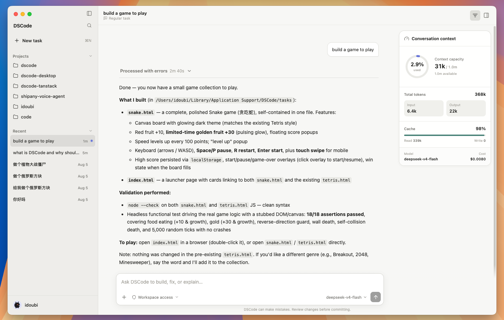

# DSCode Desktop

An Electron desktop client for [`@thinkany/dscode-core`](../../packages/core). It keeps the
agent runtime in the shared core package and provides a native desktop host for workspaces, threads,
streaming messages, tool activity, approvals, authentication, models, reasoning levels, and image
input.

## Download

<p align="center">
  
</p>

Download **DSCode Desktop v0.1.0** from the
[release page](https://github.com/thinkany-ai/dscode/releases/tag/desktop-v0.1.0):

| Platform | Installer |
| --- | --- |
| macOS · Apple Silicon | [DMG](https://github.com/thinkany-ai/dscode/releases/download/desktop-v0.1.0/DSCode_0.1.0_arm64.dmg) |
| macOS · Intel | [DMG](https://github.com/thinkany-ai/dscode/releases/download/desktop-v0.1.0/DSCode_0.1.0_x64.dmg) |
| Windows · x64 | [Setup EXE](https://github.com/thinkany-ai/dscode/releases/download/desktop-v0.1.0/DSCode_0.1.0_x64-setup.exe) |
| Debian / Ubuntu · x64 | [DEB](https://github.com/thinkany-ai/dscode/releases/download/desktop-v0.1.0/DSCode_0.1.0_amd64.deb) |
| Fedora / RHEL · x64 | [RPM](https://github.com/thinkany-ai/dscode/releases/download/desktop-v0.1.0/DSCode_0.1.0_x86_64.rpm) |

The macOS builds are signed, notarized by Apple, and stapled. Windows and Linux builds are currently
unsigned. Portable macOS ZIP archives are also available on the release page.

## Development

Requirements: Node.js 22.19+ and pnpm 10.12+. Run these commands from the repository root:

```bash
pnpm install
pnpm desktop:dev
```

The renderer supports a local browser preview with representative data when Electron's preload
bridge is absent. The production application always uses the secure preload bridge.

### Core dependency

Desktop declares `@thinkany/dscode-core` as `workspace:*`, so development and CI always use the Core
source in this repository instead of downloading a potentially different registry build. Desktop
0.1.0 is built with Core 0.3.6, which is also the current npm `latest` release. The packaged
application includes that Core build and does not require users to install Core or a system Node.js
runtime separately.

Before a Desktop release, update its npm dependencies and confirm that none are outdated:

```bash
pnpm --filter @thinkany/dscode-desktop update --latest
pnpm outdated --filter @thinkany/dscode-desktop --format json
pnpm desktop:check
```

## Checks and packaging

```bash
pnpm desktop:check
pnpm desktop:pack                         # unpacked app for the current platform
pnpm --dir apps/desktop dist              # installers for the current platform
pnpm --dir apps/desktop dist:mac          # DMG + ZIP, arm64 and x64
pnpm --dir apps/desktop dist:win          # NSIS installer, x64
pnpm --dir apps/desktop dist:linux        # DEB + RPM, x64
```

Release artifacts are written to `release/`. As with Termany, tagged macOS distribution builds are
signed with a Developer ID certificate, notarized by Apple, and stapled before release. The workflow
uses `APPLE_CERTIFICATE`, `APPLE_CERTIFICATE_PASSWORD`, `APPLE_SIGNING_IDENTITY`, `APPLE_ID`,
`APPLE_PASSWORD`, and `APPLE_TEAM_ID` repository secrets. Windows and Linux builds are currently
unsigned.

The desktop GitHub Actions workflow validates all three operating systems when Desktop or Core
changes. Pushing a tag matching `desktop-v<version>` (for example, `desktop-v0.1.0`) builds every
platform and creates a draft GitHub Release. The workflow can also be run manually for one platform,
or for all platforms with draft release creation enabled. Desktop versions and tags remain independent
from the CLI and Core release line.

Download published installers from [DSCode Releases](https://github.com/thinkany-ai/dscode/releases).
Choose the DMG matching your Mac (`arm64` for Apple Silicon or `x64` for Intel), the `-setup.exe` for
Windows, or the DEB/RPM package for Linux.

DSCode credentials, settings, project trust, and sessions remain in `~/.dscode`, shared with the
terminal client. The Electron main process starts the bundled core RPC entry with Electron's own
Node runtime, so packaged builds do not require a separate system `node` executable.

On Windows and Linux, restricted tool execution currently requires a trusted Docker sandbox image
configured through `DSCODE_SANDBOX_IMAGE`. Native non-Docker sandbox backends for those systems are
outside the packaging workflow; macOS continues to use Seatbelt.

## Architecture

- `src/main`: Electron window, native dialogs, recent workspaces, authentication, and RPC process host
- `src/preload`: context-isolated IPC surface
- `src/renderer`: React desktop UI and streaming conversation reducer
- `src/shared`: IPC contracts shared across processes

The renderer has no filesystem or Node access. Navigation is denied in-app; approved HTTP(S) links
open through the operating system browser.

## License

[MIT](LICENSE)
